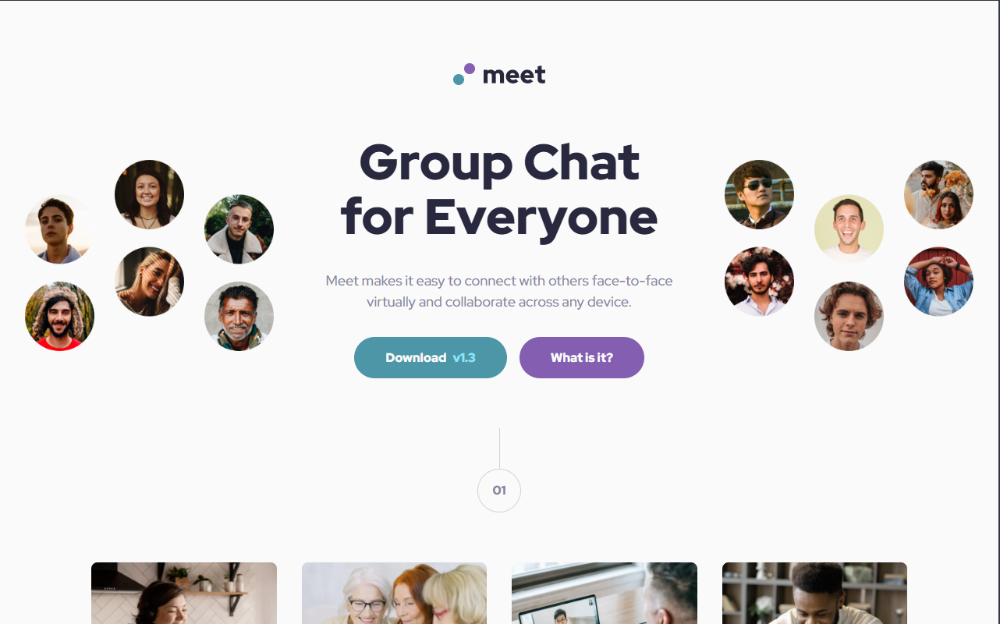

# Frontend Mentor - Meet landing page solution

This is a solution to the [Meet landing page challenge on Frontend Mentor](https://frontendmentor.io). Frontend Mentor challenges help you improve your coding skills by building realistic projects.

## Table of contents
- [Overview](#overview)
  - [The challenge](#the-challenge)
  - [Screenshot](#screenshot)
  - [Links](#links)
- My process](#my-process)
  - [Built with](#built-with)
  - [What I learned & Key Challenges](#what-i-learned--key-challenges)
  - [Project Estimation & Retrospective](#project-estimation--retrospective)
- [Author](#author)

## Overview

### The challenge
Users should be able to:
- View the optimal layout depending on their device's screen size (Desktop, Tablet 768px, Mobile).
- See interactive hover and click/active states for all buttons on the page.
- Experience a fully responsive transition from stacked structures to advanced multi-dimensional CSS Grid layouts.

### Screenshot
  
*Fig 1. Final look of my responsive Meet landing page using production-ready SCSS compilation and advanced gradient asset mixing.*

### Links
- Solution URL: [Solution Link](https://github.com/Osty-trainee/Meet-landing-page)
- Live Site URL: [Live Site Link](https://osty-trainee.github.io/Meet-landing-page/)

## My process

### Built with
- Semantic HTML5 markup (`<header>`, `<main>`, `<section>`, and `<footer>` containers for solid SEO and web accessibility)
- BEM (Block-Element-Modifier) methodology ensuring zero style leakage and clean component isolation
- Modular Sass/SCSS architecture dividing layouts into dedicated logical modules (`_fonts`, `_variables`, `_reset`, `_base`, `_header`, `_features`, `_footer`)
- CSS Grid & Flexbox (Flexbox for component alignment fallbacks; CSS Grid for asymmetric 3-column hero distributions)
- Modern asset performance delivery utilizing high-compression `.woff2` font formats via custom `@font-face` bindings
- Clean Git project state management tracking both source `scss/` folder and compiled `css/` files for portfolio code inspection

### What I learned & Key Challenges

This project was a massive milestone for me as it threw real-world responsive bugs my way. Debugging them taught me a lot about browser rendering, positioning, and stacking contexts:

1. **The Mobile Button Stretching Bug (Hero Section):** 
   When working on the mobile layout, the header action buttons suddenly stretched horizontally into massive full-width bars. I discovered that when a container has `display: flex` with `flex-direction: column`, the child elements default to `align-items: stretch` under the hood. To counter this, I overrode the layout constraints by applying a precise `align-items: center;` rule on the parent `.hero__action` wrapper, which safely deflated the buttons back into compact capsule shapes.

2. **The Floating Circle '02' Indexing & Grid Obstacles (Footer Section):**
   The trickiest architectural challenge was positioning the floating circle label with the number "02". At first, it was buried inside the footer container, causing it to drop randomly onto the background image content. 
   
   To fix it properly without messy absolute hacks, I **refactored the HTML architecture** by moving the `.section-divider` entirely outside the `<footer>` tag into the natural layout flow. I then applied a precise negative margin modifier combined with a custom stacking index rule to force the "02" circle to split the white viewport and the dark background image rail perfectly in half:
   ```scss
   .section-divider--footer {
       margin-bottom: -1.75rem; /* Pulls the footer upwards exactly under the circle label */
       position: relative;
       z-index: 10; /* Ensures the number capsule stacks safely over the footer image boundaries */
   }
   ```

3. **Multi-Layer Background Stack Blending:** 
   To mimic the complex opacity rules of the Figma design without touching Photoshop, I layered a semi-transparent `linear-gradient` directly on top of the background image link, causing the photo to smoothly fade into the pure white page background underneath:
   ```scss
   background-image: 
       linear-gradient(
           to bottom, 
           rgba(77, 150, 169, 0.9) 0%, 
           rgba(77, 150, 169, 0.9) 60%
       ),
       url('../assets/desktop/image-footer.jpg');
   ```

## Project Estimation & Retrospective
- **Initial Estimation:** 4 to 6 hours.
- **Actual Time Taken:** ~ 5 hours (including deep design systems debugging).

**Retrospective Summary:**  
While the layout seemed straightforward at first glance, fine-tuning the fluid cross-viewport typography scaling and preventing layout clipping required deep analytical focus. Refactoring the HTML structure to extract layout nodes from the footer flow saved hours of debug time and resulted in a production-grade, highly scalable code architecture.

## Author

- GitHub - [@Osty-trainee](https://github.com/Osty-trainee)
- Frontend Mentor - [@Osty-trainee](https://www.frontendmentor.io/profile/Osty-trainee)
